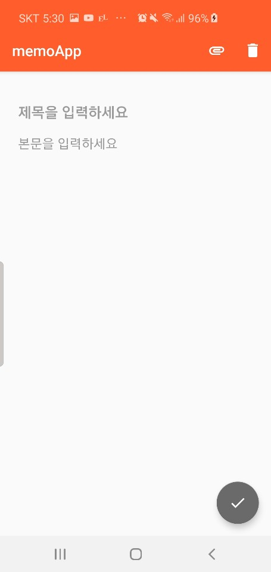
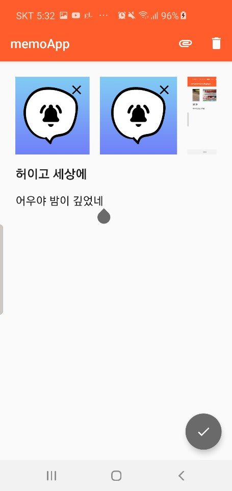
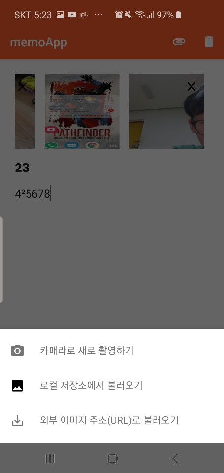

# line_programmers

line programers app challenge

사용된 기술 및 아키텍처

- ViewModel + Repository
- LiveData
- Data Binding
- Navigation with args
- Room
- Di(Dagger2) 

사용한 기타 라이브러리들 

- CameraX : 사진 촬영
- RxJava : Room background 처리
- Glide : 외부 URL 다운로드 및 이미지 로드

------

1. 메모 쓰기 (툴바 설명 : 이미지 첨부 , 쓴 메모 내용 지우기) 

   Fab 버튼은 메모를 작성할때는 저장하는 용도이며

   메모 전체 내용을 보고 있을 때는 수정 페이지로 가는 용도

2. 여러장의 이미지를 추가한 상태 수평 리사이클러뷰의 우측 상단의 X 버튼 클릭시 해당 이미지 리스트에서 삭제

3. 이미지 첨부 버튼 누를 시 BottomSheetDialog 출현

